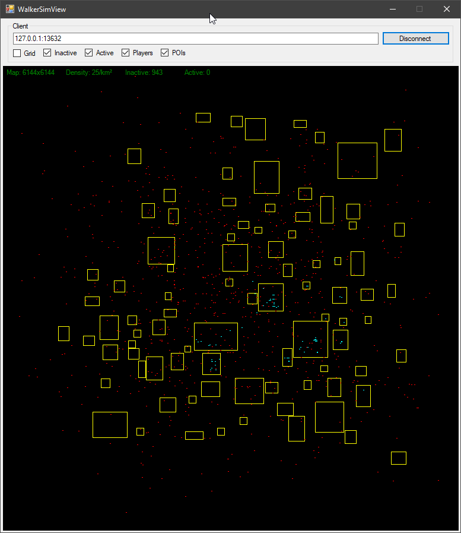

# WalkerSim
Zombie walker simulation server plugin for 7 Days to Die

# What is this?
This plugin replaces the zombie spawning model with an offline simulation. Players on the server will be 
assigned a visibility zone that decides which zombies will be active and which ones will be offline. 
If the zombie was killed it will respawn at the map border as an offline version and roams the map, if the zombie 
is still alive but leaves the player visibility it will become offline but keeping attributes such as health
and class.

# Usage
Drop the plugin into the Mods folder and make sure you have "EnemySpawnMode" set to false in your server configuration,
this is important to ensure the game will not try to spawn zombies on its own anymore. Boot up your server and thats it.

# Binaries
Will follow soon, right now you need to compile it on your own.

# Bugs
This is more a proof of concept than a fully fledged plugin at this point, so be aware.
