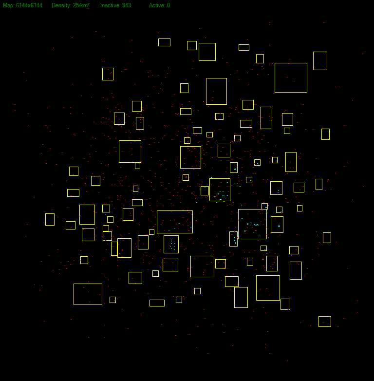
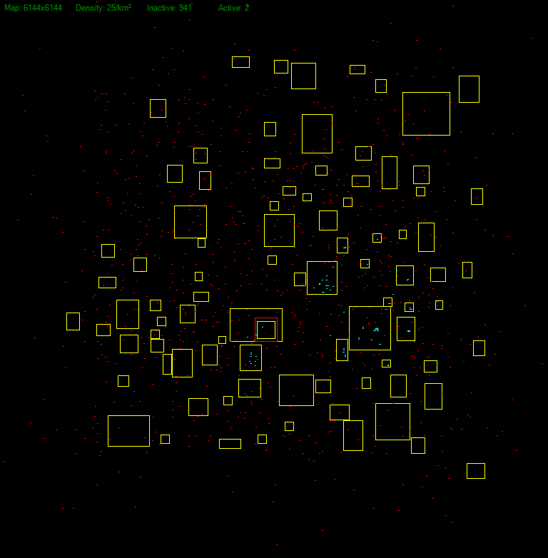

# WalkerSim
Zombie walker simulation server plugin for 7 Days to Die

# What is this?
This plugin replaces the zombie spawning model with an offline simulation. Players on the server will be 
assigned a visibility zone that decides which zombies will be active and which ones will be offline. 
If the zombie was killed it will respawn at the map border as an offline version and roams the map, if the zombie 
is still alive but leaves the player visibility it will become offline but keeping attributes such as health
and class.

# How does it work?
The simulation will create a finite set of zombies based on the population size. The zombie agents will roam the map
by picking random zones of the configurable grid. Once a zombie reached the desired target zone it will pick a new zone
and keeps wandering. 

  
Players will have a box around them, the size of the box is determined by the servers maximum view
configuration, if the zombie agent crosses into the players box border it will create a real in-game zombie, if the
zombie is out of the player zone it will be despawned and moved back into the simulation retaining its position and
attributes such as health and zombie class, if a zombie is killed the simulation will create a new agent near the border.

  
Sleepers are also included in the simulation, unlike zombies they wander towards a random spawn destination set by the prefab.
Once the sleeper reaches the target destination it will go to sleep and stay there until the player activates the zombie, if they
die they also respawn at the border like normal agents. Its also possible that a player can activate a sleeper while walking towards
the sleeper spawn.

  
Blue dots in the image are sleepers.

# Inspecting the simulation
The plugin also provides a viewer client, the server must be required to enable this specifically as it consumes a rather big
amount of bandwidth, it is currently not optimized or pretty but but helps the development a lot.

# Usage
Drop the plugin into the Mods folder and make sure you have "EnemySpawnMode" set to false in your server configuration,
this is important to ensure the game will not try to spawn zombies on its own anymore. Boot up your server and thats it.

# Binaries
Will follow soon, right now you need to compile it on your own.

# Bugs
This is more a proof of concept than a fully fledged plugin at this point, so be aware.
